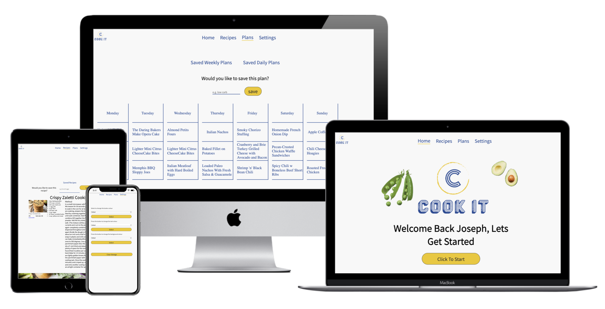
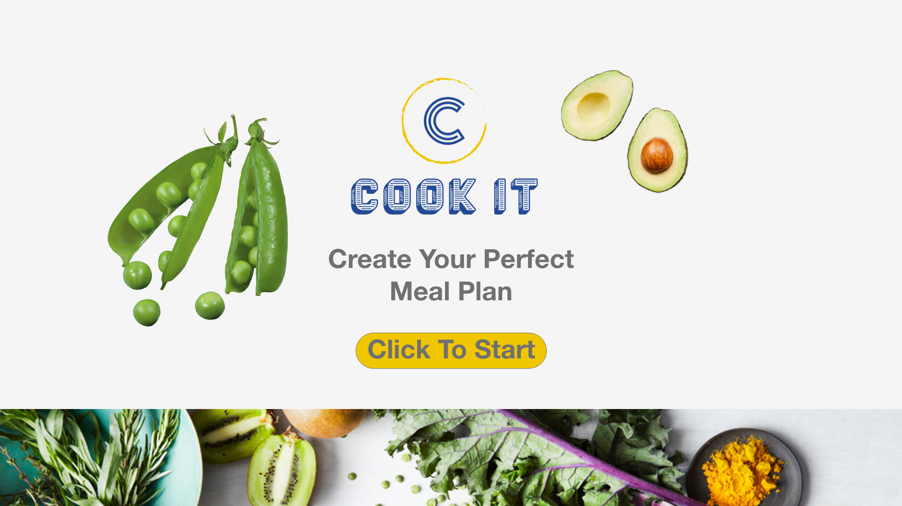

# README for CookIt.com

## Intro

CookIt is a food plan delivery business, they would like an interactive part of their website that allows users to create a meal plan suited for their dietary needs and any other requirements that they need.

The needs of the web application from the founder are

To allow potential customers to add their data
To have the web application be personal to the user
To have them able to create a plan by day or week
To be able to see the recipes in each plan
Easy access to recipes of plans that they like

[live site](https://josephwoodland.github.io/MS2---Cookit.com/)

## Index

- <a href="#The-Website-Brief" >The Website Brief</a>
- <a href="#ux">UX</a>
- <a href="#design">Design</a>
- <a href="#testing">Testing</a>
- <a href="#deployment">Deployment</a>
- <a href="#future">Future Features</a>
- <a href="#credits">Credits</a>

  
# The Website Brief

This is a copy of the [brief](assets/readme/Assets/Brief - Cook it.pdf)

## Summary of the brief

The app is going to be linked from the bigger website and linked directly from the email. The purpose of the app is to get people interacting with the brand, so they can be targeted in future campaigns trying to sell the meal plan section of the business.

The site should - where possible be on one screen - not linking to different pages to make it feel quicker.

The site should be as clean as possible and not cluttered, easy and clear to navigate.

They requested a Desktop first design that is mobile friendly - they have an idea of their customer using a laptop or desktop to order their food plan so marketing will be focused around that.

  
# UX

### Target Audience

The target audience for this project is a single busy professional. Who works on their laptop or desktop, has the money to afford to pay for a meal plan.

## Website Goals

### Client

- To make an easy to use and understand web application.
- To create something that will get users coming back each week.
- Needs to have some sort of personal aspect to the site.
- Does not move the users around different pages to make the app feel quicker.

### Users

- As a user, I want to be able to have a program create a meal plan for me
- As a user, I want to be able to have the plan fit my diet.
- As a user, I want to have access to recipes that I can cook myself.
- As a user, I want to be able to save plans or recipe that I have liked so I can have access to them again quickly.

### Functions for the app

App must have the ability to make the app personal for each user.
App must have the ability to allow the user to input data to the app, and give a meal plan.
suggestion around the user input i.e. Dietary information.
App must be able to show the recipe for each meal suggestion.
App must have some sort of save function where the user can see saved recipe of plan data.
Must be quick and not to move users around different pages unecsearily.

## User Journey

This is an example of a successful user journey.

I have been redirected to this app via email.
I am interested in looking at the meal plan creator.
I can find and input easily all of my dietary needs.
I can quickly see what suggestions have been made by the computer.
I like the suggestions I have been given and will save the results
I can quickly see from the plan how to make each recipe
I can store these recipes separate so I can have quick access to them during the plan that has been created for me.
That was easy I will use it next week.

## Sections of the Web App

### General Layout

Given the brief from the client, we are looking at a desktop-first approach, making the app a single static page that fills the screen and will adapt to each screen size. They would like to pop up modals to show different information.

### Navigation bar

The navigation bar will be static and have space to add and hide interactive buttons if needed.

### Home section

The home section should be clean and have enough space to fit all the necessary potential information that is needed. I.e a weekly meal plan. All easy to see and understand.

### Popup Modal

Modal must carry on in inline with the brand and design of the web app. Must have enough space in the main section of the modal to fill in all the necessary information from potential recipes. Also must be easily accessible and made simple to navigate out of.

Must be interactive and not moving from place to place to create a better user experience.

### Footer

The footer on this project is not too important, no information is needed in there -  just have a picture there to break up the page a little.

## Wireframes

Here is a sample of the original wireframes for the app approved by the client.

Other wireframes can be downloaded [here in xd format](assets/readme/xd/Cookit - Wireframes.xd)

# Design

The design elements were influenced and informed by the client’s brief, specifically the client’s brand guidelines which included the look and feel and TOV (tone of voice).

## Font

### Copy

- Noto Sans JP and as a back up sans-serif

### Main colours

Brand colours are 

## Features for the website

### Responsive design on all devices

- Website must be functional on all screen sizes

### Interactive page

- Page HTML must be interactive for the user and feel fluid

## Technologies Used

### Languages

HTML5 - I used HTML 5 for the layout and structure of the website.

CSS - CSS has been used to style the HTML 5 elements.

Vanilla JavaScript - Javascript has been used to make the HTML 5 elements interactive for the user and to mutate the onscreen HTML

## API - Spoonacular

I used the Spoonacular API to work with using javascript to make calls to the API and fetch the data.

Follow the link to see the API documentation.

[Spoonacular](https://spoonacular.com/food-api/docs/)

## Styling Architecture - SCSS

As I am coding different elements on the page, some that are only visible on user interaction, I have decided to use SCSS architecture to write my code.

Using the import feature of SCSS would first allow me to structure the architecture of the project in a much cleaner way. This style of architecture allows for smaller files that can be easily connected and identified.

Allowing the use of variables makes it easy if there is any brand change that could potentially come up.

Using the nesting feature of SCSS allows for cleaner code making site upkeep and bug fixes easier to locate and address.

## Coding Architecture - Model - View - Controller

I am using the MVC(Model - View - Controller) architecture to organise my JS files. I found this way of organizing my file base easy to understand, and clean to look at, and designed in a way to reduce the length of single js files.

The Model.js page is there to handle all the data that is used by the app, this makes it easy to try and look for any problems with the use of data.

The View.js files are handling anything to do with changing the view of the HTML, anything that prints ad replaces HTML

The Controller.js file will have anything to do with the connection between the two. Calling the initial information needed to start the app.

## VS Code

I used VS Code as my code editor. In the code editor, the extensions that I used were:

- Prettier - to automatically format my code for basic formatting mistakes and to have a consistent style throughout the code.
- Npm - I used this extension to give npm support for the version of VS Code I have.
- Image preview - I used this extension that shows a preview of any linked images in my code to help me quickly identify if the URL path is correct and to identify the right image.
- Markdown all in one - I used this which enabled me to edit the readme file with live preview in VS Code.

## Node modules

I used basic node modules to help me code in a smoother and more organized approach.

- Devsever - I used the dev server module to live to reload my project, on a change of the code. This made it easier to see changes I had been making to the code.

- Node-sass - I used this to node so I could use the SCSS file and architecture.

- Watch sass - I used this module to compile the SCSS structure and architecture that I was using into a CSS format.

- Autoprefixer - I used this extension to add prefixes to my code for added browser support.

- Font Awesome - I used this extension to integrate free icons into the page.

## Outside libraries

- Google font - I used the Google font library for the font family on the website.

## CSS Pseudo-classes

- Hover: I used the hover class to change the state of various items over the page. This is a familiar convention that signals to the site visitor the interactive site elements/features they can engage with.

## JavaScript

I used JavaScript to compute the logic of my project, I have highlighted some of the more recent static sugar only available in the later version of JavaScript

Spread operator - Used this when retrieving the data from the local storage to spread the object and then search for matching keys
Async - Await - I used this method when making calls to the API, combined with the fetch method, It makes the code self-explanatory
Optional chaining - I sued this as an easy way to check if an element exists then call methods on the object. Instead of writing an if block.

## Software Used

- Git - This was used to manage the different versions of my project, using different branches to test and add new features/sections to the website. Once tested they were then merged into the master branch and then, using Git Desktop pushed to the Git Hub repository.

- Git Desktop - I used this to manage commits and push them to the GitHub repository

-Source tree - I used this to manage my git branches, also to edit commit messages

- GitHub - I used GitHub to store the version of the project remotely.

- Adobe XD - I used XD to create and build the wireframes, to design some of the unique icons on the page and the unique colour patterns on the page.

## Online resources

### [W3 Schools](https://www.w3schools.com/)

### [Stack Overflow](https://stackoverflow.com/)

### [npm](https://www.npmjs.com/)

### [MDN](https://developer.mozilla.org/en-US/)

# Testing

## Automated Code Validation

In JShint there was an issue with call a variable ‘name’ on the welcome.js file as the is a window. name on the global scope - so I changed it to ‘userName’ and it then passed with no warnings.

I passed the code through the online code checking tool [w3validator](https://validator.w3.org/)

- Html Code has passed through the validator with no issues or warnings.

- CSS code passed through the validator with no issues or warnings.

### Chrome DevTools

I completed an audit on the web app.

Desktop

Mobile

- ### Performance = Ok

-The comments from the program was due to having data in local storage which was affecting the loading time

- ### Accessibility = Good

  - This test was 100 across all tests.

- ### Best Practices = Good

Marked down for having some images load in the wrong aspect ratio on some mobile screens

- ### SEO = Good

No comments

## Manual testing

### Testing Environments

I used branches in Git to create a safer environment to develop different features and sections of the app. Once the initial section/feature had been finished and the initial test had been completed, the branch would merge with the master branch.

I used two sets of hardware to undergo building and completing the tests for the app a, I was using a 2012 28 inc iMac and a 2020 13inch Mackbook air with the M1 processor. On both, I was primarily using the Google Chrome web browser.

### Desktop testing

Platforms :

- Mac book air 2020 M1 -OS Big Sur
- iMac - OS Catalina

Browsers:

- Chrome
- Firefox
- Safari

Mobile testing:

- Pixel 3 (Android 11)
- iPhone 7 (IOS 14)

Browsers:

- Chrome
- Safari
- 

## Testing - Design Responsiveness

### Simulated Testing

For each section on each page, I tested various screen sizes in the development environment. Using the Google Developer tools I tested the responsiveness throughout the development process. I updated the code as I tested, noting anything that appeared irregular or out of sync with the layout of the page.

Tested with Chrome DevTools using profiles for with screen sizes:

- Moto G4
- Galaxy S5
- Pixel 2
- Pixel 2 XL
- iPhone 5 SE
- iPhone 6/7/8
- iPhone 6/7/8 Plus
- iPhone X
- iPad
- iPad Pro

Also used the responsive profiles preset in the dev tools of:

- Mobile S (320px)
- Mobile M (375px)
- Mobile L (425px)
- Tablet (768px)
- Laptop (1024px)
- Laptop L (1440px)

## Major testing issues identified

- The major problem I faced when testing on smaller screens was down to the pop up modal, I spent a long time trying to fix the formatting but I ended up having to change the lay out to the app, and not use any modal in the app.

- If you keep using the save button, t,he function will keep on printing the name to the screen repeatedly fix I made the page reload after saving.

## User testing

I had two users test my app remotely, although the reasons for them using the app does not align with the user story goals, having them use the app as a user and completing different tasks was beinifitial.

### User Tests

Results from user 1 test -

Spelling errors on metric and imperial drop down. Overall gramma check - no need to capitalise each letter in a heading/sentence I.e ‘Ok Chanel, Let’ Create A Meal Plan’ this can just be ‘Okay Chanel, let’s create a meal plan’.
Button: change to ‘create my plan’
Clicked on a menu in my meal plan, then pressed back in the browser and the meal plan was gone. This shlud take the user back to the meal plan loading in the browser.
Saved plan as ‘week 1’ went to saved plans, selected week 1 but unresponsive - app should of loaded the saved plan and rendered it the the HTML.
Saved recipes: when there are no saved recipes, perhaps change the copy to ‘oh, looks like you don’t have any recipes saved. Click here to start building your meal plan’. Same for plans, when none are saved/made yet.

Results from user 2 test -

## Testing Checklists

Thi was a list of all the interactive features on the app and if they respond in the correct way’

### User Goals

## Issues and challenges I encountered

### Modal

The biggest issue I faced was having the app use modal’s to render certain types of information. The issue I had was making the design responsive on smaller screens, have a modal on smaller screens was a real issue and did not work. Trying to make it work the code started to feel quite fragile.

To fix this I decided to have a redesign of the app, and instead of rendering different HTML to the inside of a pop up modal, just have it all on one web page.

## Known bugs

### Weekly plan

This is a formatting bug, when shrinking the size of the viewing window in the browser, at a certain size the edge of the rendered weekly plan can be missed.

# Deployment

I used multiple branches in this project; the master branch is the main deployment branch which will be the most up-to-date and deployable version of the code.

## How to deploy

To deploy this page to GitHub Pages from its GitHub repository, the following steps were taken:

- Select Settings from the top menu above the file window
- Scroll down to the GitHub Pages section
- Under Source click the drop-down menu and select Master Branch
- On selecting Master Branch the page will be automatically refreshed and the website is now deployed
- Scroll back down to the GitHub Pages section in Settings to retrieve the link to the deployed website.

## Run this code locally

Clone this project from GitHub by the terminal:

- Under the repository name, click Clone or download
- In the Clone with HTTP section, copy the clone URL for the repository
- In your local IDE open Git Bash
- Change the current working directory to the location where you want the cloned directory to be made
- Type git clone and then paste the URL you copied in Step 2
<https://github.com/josephWoodland/MS2---CookIt.com.git>
- Press Enter. Your local clone will be created

Clone this project from GitHub by the Git Desktop:

- Under the repository name, click Clone or download
- Click the option to used GitHub Desktop
- In the clone, Repository Modal choose where you would like it to be stored locally
- The clone has been created and stored in your local file.

Further reading and troubleshooting on cloning a repository from GitHub can be found [here](https://docs.github.com/en/github/creating-cloning-and-archiving-repositories/cloning-a-repository)

## Running the code

As I have been using node_modules. You will have to have npm installed on your computer to find details [here](https://www.npmjs.com/).

Once you have got the files in your coder of choice, run `npm install` to install the modules and settings laid out in the package.json file.

To use the `watch:sass` and the live reload modules for the development environment in the terminal use npm start, once this has started a window with the website loaded with the current code.

# Future Features

### Shopping basket

- I would like to integrate a shopping basket where the app can format a shopping list from meal plan.

### Rate the plan

- I would like to add a function where the user can rate the response from the API.

# CREDITS

There is no code that a copied in this project.
